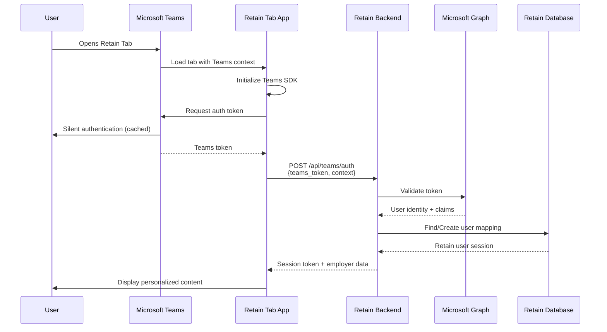
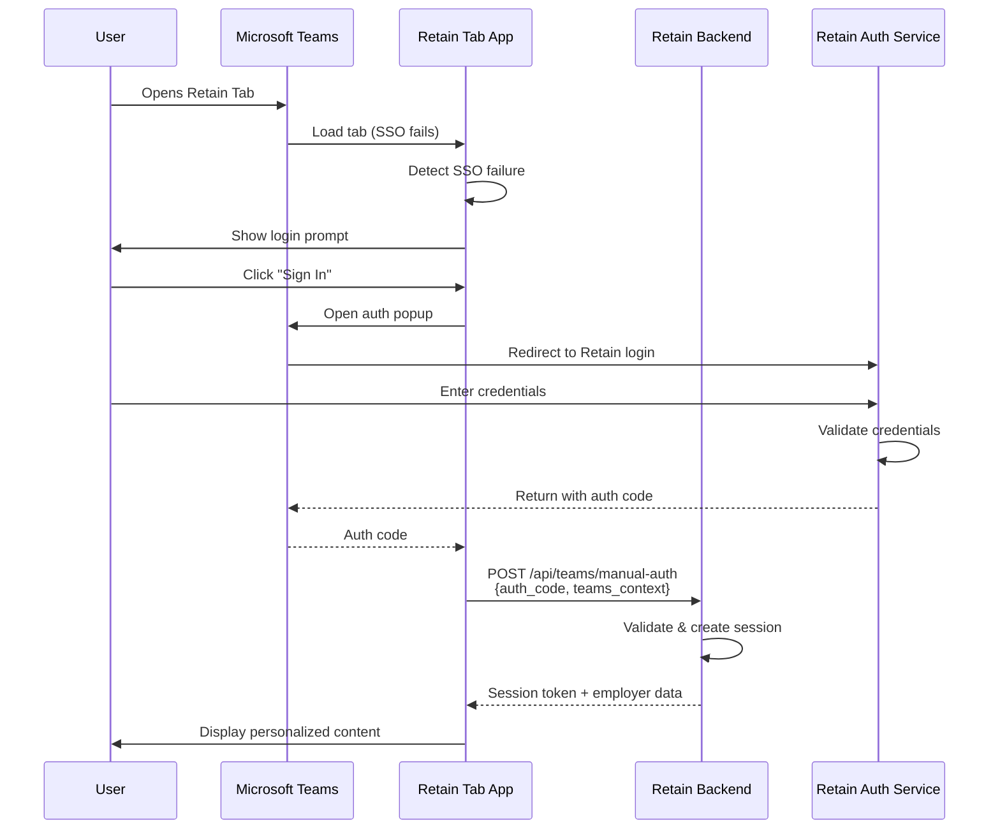
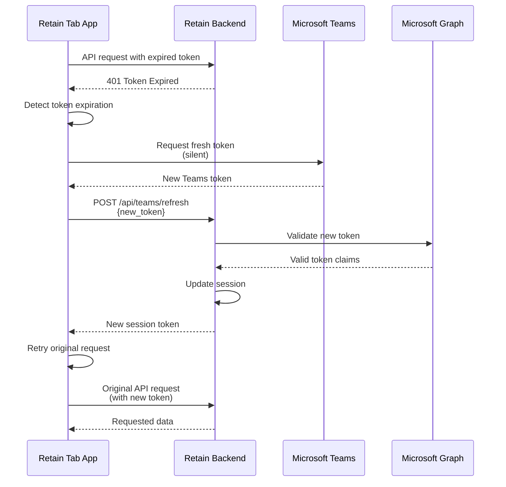
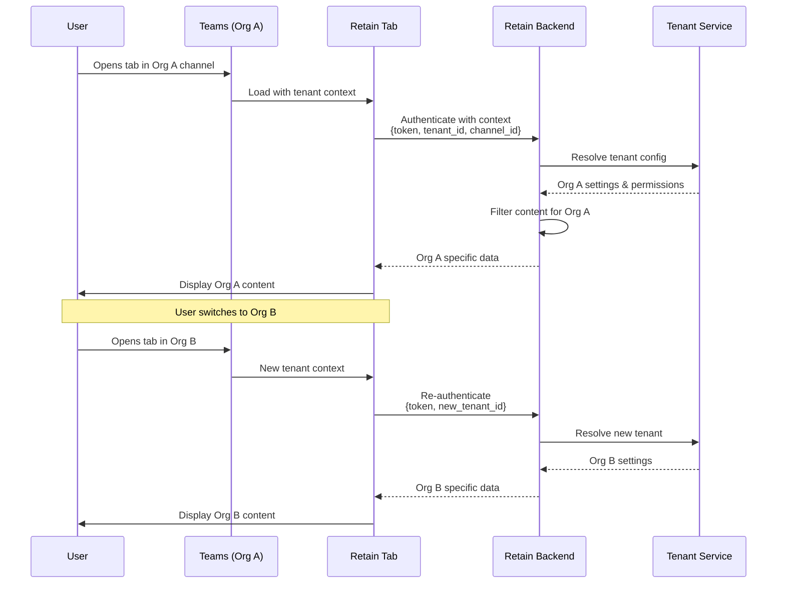
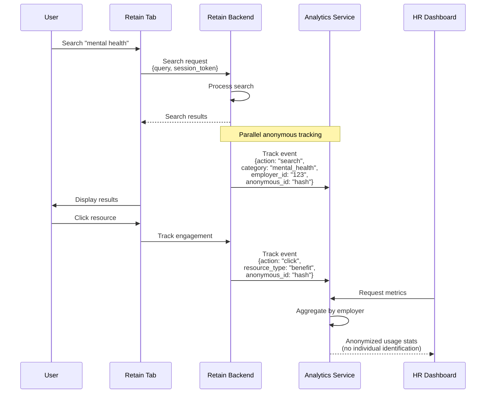

# Teams Integration Authentication Interaction Diagrams

## 1. Primary Flow: Teams SSO Authentication

## 2. Fallback: Manual Authentication Flow

## 3. Token Refresh Flow

## 4. Multi-Tenant Context Flow

## 5. Anonymous Analytics Preservation

## Key Design Principles

1. **Zero-friction primary path**: SSO should work silently for most users
2. **Graceful degradation**: Manual auth available when SSO fails
3. **Transparent refresh**: Users never see token expiration
4. **Strict tenant isolation**: Each organization's data stays separate
5. **Privacy by design**: Analytics never link to individual identity

## Error Handling Points

- **SSO Failure**: Automatic fallback to manual flow
- **Token Expiration**: Silent refresh without user intervention
- **Network Issues**: Retry with exponential backoff
- **Tenant Mismatch**: Re-authenticate with correct context
- **Graph API Errors**: Cache validation results, proceed with limited features