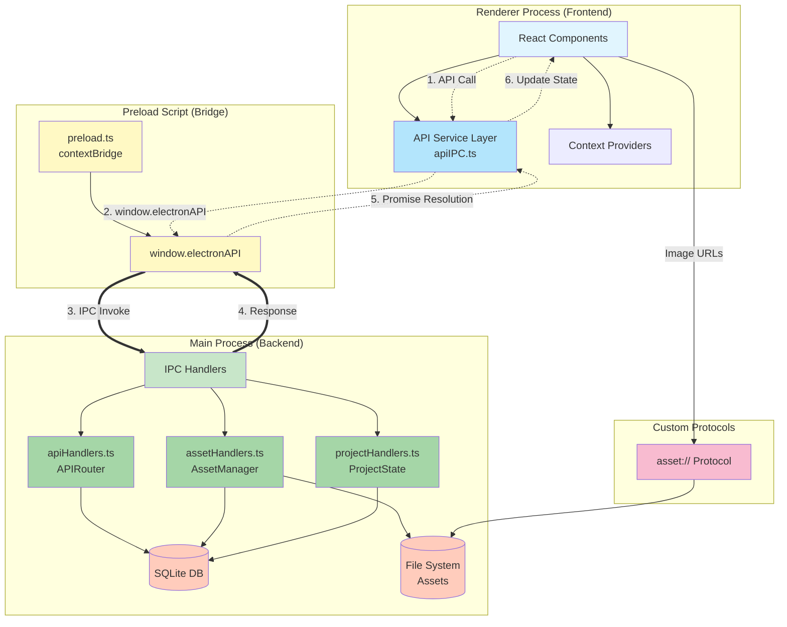
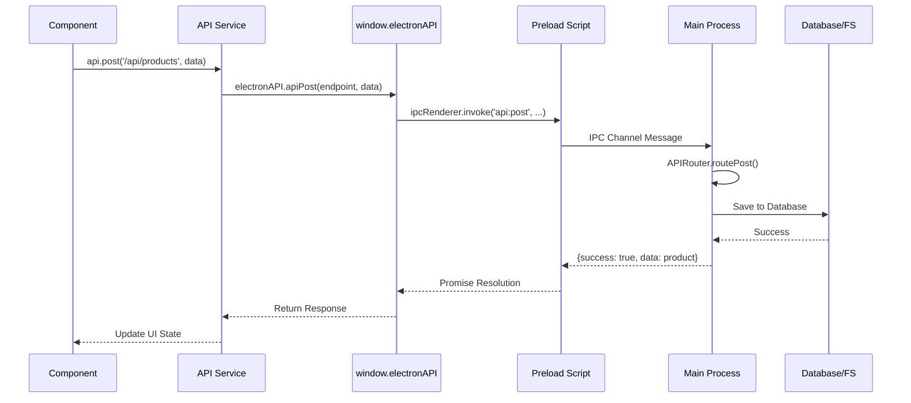
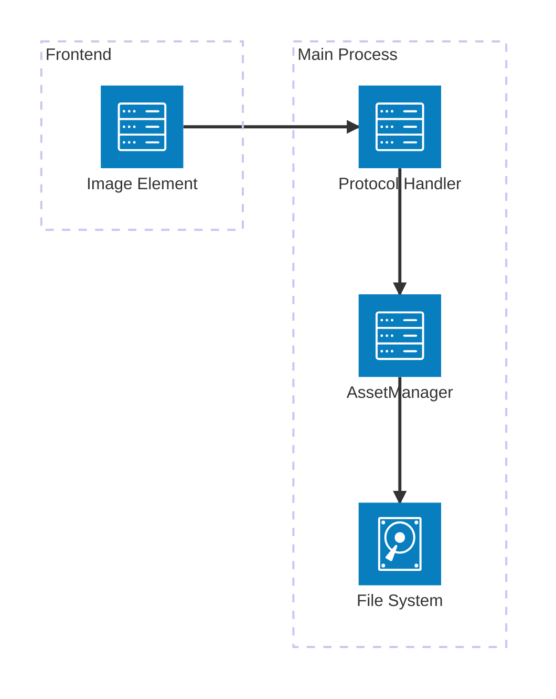
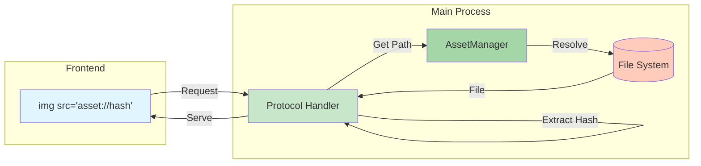

# Electron App API Architecture Documentation

## Overview
The Electron app uses a secure IPC (Inter-Process Communication) architecture to facilitate communication between the renderer process (React frontend) and the main process (Node.js backend). This architecture ensures security through context isolation while providing a clean API interface for the frontend.

## Architecture Diagram

### Classic Architecture Diagram (Detailed View)



## Architecture Components

### 1. Main Process API Handlers (`src/main/ipc/`)
APIs are defined in the main process as IPC handlers that respond to invocations from the renderer process.

#### Handler Files:
- **`apiHandlers.ts`** - General API operations (CRUD for products, projects, etc.)
- **`assetHandlers.ts`** - Asset management (upload, storage, retrieval)
- **`projectHandlers.ts`** - Project-specific operations

#### How APIs are Defined:
```typescript
// Example from assetHandlers.ts
ipcMain.handle('asset:upload', async (_event, fileData: ArrayBuffer, filename: string, mimetype: string, options?: AssetStorageOptions) => {
  try {
    // Implementation logic
    return {
      success: true,
      data: { /* response data */ }
    };
  } catch (error) {
    return {
      success: false,
      error: error.message
    };
  }
});
```

### 2. Preload Script (`src/main/preload.ts`)
The preload script acts as a secure bridge between the main and renderer processes using Electron's `contextBridge` API.

#### Key Functions:
- **Context Isolation**: Prevents direct access to Node.js APIs from renderer
- **API Exposure**: Selectively exposes specific functions to the renderer
- **Type Safety**: Maintains consistent interface contracts

#### API Categories Exposed:

##### System Information
```typescript
platform: process.platform
versions: {
  node: process.versions.node,
  chrome: process.versions.chrome,
  electron: process.versions.electron
}
```

##### Project Operations
```typescript
getCurrentProject: () => ipcRenderer.invoke('project:get-current')
closeProject: () => ipcRenderer.invoke('project:close')
saveProject: (updates?: any) => ipcRenderer.invoke('project:save', updates)
markProjectDirty: () => ipcRenderer.invoke('project:mark-dirty')
getRecentProjects: () => ipcRenderer.invoke('project:get-recent')
clearRecentProjects: () => ipcRenderer.invoke('project:clear-recent')
openProjectFromPath: (filePath: string) => ipcRenderer.invoke('project:open-path', filePath)
```

##### API Operations (REST-like)
```typescript
apiGet: (endpoint: string, params?: any) => ipcRenderer.invoke('api:get', endpoint, params)
apiPost: (endpoint: string, data?: any) => ipcRenderer.invoke('api:post', endpoint, data)
apiPut: (endpoint: string, data?: any) => ipcRenderer.invoke('api:put', endpoint, data)
apiDelete: (endpoint: string) => ipcRenderer.invoke('api:delete', endpoint)
apiScrape: (request: any) => ipcRenderer.invoke('api:scrape-product', request)
```

##### Asset Management
```typescript
assetUpload: (fileData: ArrayBuffer, filename: string, mimetype: string, options?: any) =>
  ipcRenderer.invoke('asset:upload', fileData, filename, mimetype, options)
assetGetPath: (hash: string, thumbnail?: boolean) =>
  ipcRenderer.invoke('asset:get-path', hash, thumbnail)
assetDelete: (hash: string) =>
  ipcRenderer.invoke('asset:delete', hash)
assetCleanup: (options?: { removeOlderThan?: number; dryRun?: boolean }) =>
  ipcRenderer.invoke('asset:cleanup', options)
assetImportBatch: (files: Array<{ data: ArrayBuffer; filename: string }>, options?: any) =>
  ipcRenderer.invoke('asset:import-batch', files, options)
assetStatistics: () =>
  ipcRenderer.invoke('asset:statistics')
```

##### Event Listeners
```typescript
onProjectChanged: (callback: (projectInfo: any) => void) => {
  ipcRenderer.on('project:changed', (_event, projectInfo) => callback(projectInfo));
}
removeProjectChangedListener: () => {
  ipcRenderer.removeAllListeners('project:changed');
}
```

### 3. Frontend API Consumption

#### TypeScript Interface (`src/shared/types.ts`)
```typescript
export interface ElectronAPI {
  platform: string;
  versions: { node: string; chrome: string; electron: string; };
  getCurrentProject: () => Promise<any>;
  closeProject: () => Promise<{ success: boolean; reason?: string; error?: string }>;
  saveProject: (updates?: any) => Promise<{ success: boolean; error?: string }>;
  // ... other methods
}

declare global {
  interface Window {
    electronAPI: ElectronAPI;
  }
}
```

#### API Service Layer (`src/renderer/services/apiIPC.ts`)
The frontend uses a service layer that wraps the IPC calls to provide a clean, promise-based API:

```typescript
export const api = {
  get: async <T>(endpoint: string, params?: Record<string, any>): Promise<ApiResponse<T>> => {
    if (!window.electronAPI) {
      throw new ApiError('Electron API not available', 'ELECTRON_UNAVAILABLE');
    }

    try {
      const result = await window.electronAPI.apiGet(endpoint, params);
      if (!result.success) {
        throw new ApiError(result.error || 'Request failed', 'API_ERROR');
      }
      return result;
    } catch (error) {
      // Error handling
    }
  },

  post: async <T>(endpoint: string, data?: any): Promise<ApiResponse<T>> => {
    // Similar implementation
  },

  // Other methods...
};
```

#### Component Usage Examples

##### Creating a Product:
```typescript
// In ProductNew.tsx
const handleSaveProduct = async () => {
  try {
    await api.post('/api/products', {
      ...formData,
      projectId: 'current'
    });
    showToast('Product saved successfully', 'success');
  } catch (error) {
    const apiError = handleApiError(error);
    showToast(apiError.message, 'error');
  }
};
```

##### Uploading an Asset:
```typescript
// In ProductNew.tsx
const handleImageUpload = async (file: File) => {
  // Convert file to ArrayBuffer
  const arrayBuffer = await file.arrayBuffer();

  // Upload via IPC
  const response = await window.electronAPI.assetUpload(
    arrayBuffer,
    file.name,
    file.type
  );

  if (response.success) {
    setFormData(prev => ({
      ...prev,
      primaryImageHash: response.data.hash,
      primaryThumbnailHash: response.data.thumbnailHash
    }));
  }
};
```

##### Listening to Project Changes:
```typescript
// In ElectronProjectContext.tsx
useEffect(() => {
  const handleProjectChange = (projectInfo: any) => {
    setProject(projectInfo);
  };

  window.electronAPI.onProjectChanged(handleProjectChange);

  return () => {
    window.electronAPI.removeProjectChangedListener();
  };
}, []);
```

## Data Flow Architecture

### Data Flow Sequence



## Request Flow Example: Product Creation
```
ProductNew.tsx
  ↓ (calls)
api.post('/api/products', data)
  ↓ (invokes)
window.electronAPI.apiPost('/api/products', data)
  ↓ (IPC invoke)
ipcRenderer.invoke('api:post', '/api/products', data)
  ↓ (handled by)
ipcMain.handle('api:post', ...) in apiHandlers.ts
  ↓ (routes to)
APIRouter.createProduct(data)
  ↓ (returns)
{ success: true, data: product }
```

## Security Model

### Context Isolation
- Renderer process has no direct access to Node.js APIs
- All communication goes through the preload script
- Preload script explicitly defines what APIs are available

### IPC Channel Security
- Named channels with clear purpose (e.g., `asset:upload`, `project:save`)
- Input validation in main process handlers
- Error boundaries prevent crashes from propagating

### Data Validation
- Type checking via TypeScript interfaces
- Runtime validation in handlers
- Sanitization of file paths and user input

## Adding New APIs

### Step 1: Define Handler in Main Process
```typescript
// In appropriate handler file (e.g., apiHandlers.ts)
ipcMain.handle('feature:action', async (_event, param1: string, param2: number) => {
  try {
    // Implementation
    return { success: true, data: result };
  } catch (error) {
    return { success: false, error: error.message };
  }
});
```

### Step 2: Expose in Preload Script
```typescript
// In preload.ts
featureAction: (param1: string, param2: number) =>
  ipcRenderer.invoke('feature:action', param1, param2)
```

### Step 3: Add TypeScript Types
```typescript
// In shared/types.ts
export interface ElectronAPI {
  // ... existing methods
  featureAction: (param1: string, param2: number) => Promise<any>;
}
```

### Step 4: Create Service Wrapper (Optional)
```typescript
// In appropriate service file
export const featureService = {
  performAction: async (param1: string, param2: number) => {
    const response = await window.electronAPI.featureAction(param1, param2);
    if (!response.success) {
      throw new Error(response.error);
    }
    return response.data;
  }
};
```

### Step 5: Use in Components
```typescript
// In React component
const handleAction = async () => {
  try {
    const result = await featureService.performAction('value', 123);
    // Handle success
  } catch (error) {
    // Handle error
  }
};
```

## API Endpoint Routing

The `APIRouter` class in `apiHandlers.ts` implements REST-like routing:

### Supported Endpoints:
- `GET /api/projects` - List all projects
- `GET /api/projects/:id` - Get specific project
- `GET /api/projects/:id/products` - Get products for project
- `GET /api/products/:id` - Get specific product
- `GET /api/locations` - List all locations
- `GET /api/categories` - List all categories
- `POST /api/projects` - Create project
- `POST /api/products` - Create product
- `POST /api/locations` - Create location
- `POST /api/categories` - Create category
- `PUT /api/projects/:id` - Update project
- `PUT /api/products/:id` - Update product
- `DELETE /api/projects/:id` - Delete project
- `DELETE /api/products/:id` - Delete product

## Custom Protocols

### Asset Protocol (`asset://`)

#### Asset Protocol Architecture (New Syntax)



#### Asset Protocol Flow (Classic)



The app registers a custom protocol for serving assets:

```typescript
// Registration in main/index.ts
protocol.registerSchemesAsPrivileged([{
  scheme: 'asset',
  privileges: {
    secure: true,
    standard: true,
    supportFetchAPI: true,
    corsEnabled: false
  }
}]);

// Handler
protocol.registerFileProtocol('asset', async (request, callback) => {
  // Extract hash from URL (asset://hash)
  // Resolve to file path using AssetManager
  // Serve file
});
```

Usage in frontend:
```html

```

## Best Practices

### 1. Error Handling
- Always wrap IPC calls in try-catch blocks
- Return consistent error structures
- Log errors in main process for debugging

### 2. Type Safety
- Define TypeScript interfaces for all API contracts
- Use generics for response types
- Validate input types at runtime

### 3. Performance
- Use ArrayBuffer for binary data (images, files)
- Implement caching where appropriate
- Batch operations when possible

### 4. Security
- Never expose sensitive Node.js APIs
- Validate all input in main process
- Use content security policy in renderer

### 5. Maintainability
- Group related handlers in single files
- Keep API surface minimal and focused
- Document all public APIs
- Version APIs when making breaking changes

## Testing APIs

### Unit Testing Handlers
```typescript
// Mock ipcMain for testing
jest.mock('electron', () => ({
  ipcMain: {
    handle: jest.fn()
  }
}));

// Test handler logic directly
```

### Integration Testing
```typescript
// Use spectron or playwright for end-to-end testing
// Test full IPC flow from renderer to main and back
```

## Debugging

### Main Process
- Use console.log in handlers
- Check main process console in development
- Use Chrome DevTools for Node.js debugging

### Renderer Process
- Use browser DevTools console
- Check Network tab for asset:// requests
- Use React DevTools for component state

### IPC Communication
- Log all IPC invocations in development
- Use event listeners to monitor IPC traffic
- Check for unhandled promise rejections

## Migration Notes

This architecture replaces a previous HTTP-based mock API with IPC calls, maintaining the same interface for backward compatibility. The benefits include:
- Eliminated need for local server
- Direct file system access
- Better performance
- Tighter integration with OS
- Simplified deployment
